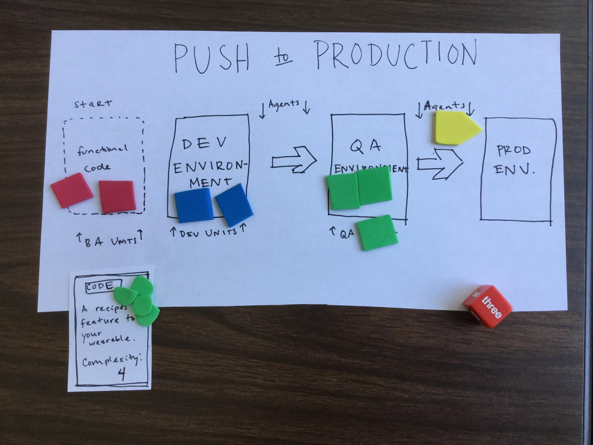

	**Each player represents one whole software development team, who wants to scope, push, and build bug-free code to The Production Environment before the other software development teams do.** 

* The path to the Production Environment is preceded by a Dev Environment and a QA Environment. 

* Each player’s software development team consists of BA units, Dev units, QA units, and Agents to facilitate pushing and building code from one environment to the next.

* Functional Code that gets pushed to production must be Bug-Free and have 0 Bugs

* **Summary**: each turn, a player will allocate and arrange their software development team (BA units, Dev units, QA units, and Agents) to best configure how the team will scope, push and build quality code. 

    * More BA Units on a team will help manage scope -- this lowers the amount of functional code that comes through the team

    * More Dev Units on a team will help push code through the Dev environment and will lower the number of Bugs in Code. Dev Units can only push code in Dev Environments.

    * More QA Units on a team will help push code through the QA environment, and will lower the number of Bugs in Code. QA Units can only push code in QA Environments.

    * More Agents will help build code between the environments

Concepts to know:

* Functional Code: a player draws a card that represents Functional Code at the beginning of their turn. Functional Code begins in the Dev Environment and is acted upon BA Units, Dev Units, Agents, and QA Units. The goal is to get Functional Code with a calculated number of Bugs = 0 to the Production Environment. The number of bugs gets calculated at the time of going into the Production Environment.

    * Each piece of Functional Code has a Complexity. In the beginning of the game, the Complexity levels are low. The Complexity levels are used to calculate the number of Bugs in production code.

* Scoping (Managing Scope): Allocating BA units to act upon Functional Code reduces the Functional Code’s Complexity score (and thus lowers the chance of Bugs)

* Pushing: Allocating Dev units and QA units to act upon Functional Code allows Functional Code to move to Inbetween zones of different Environments.

* Building: Allocating Agents to act upon Functional Code allows Functional Code to move from inbetween zones of different Environments to the next Environment

An example turn:

1. A player draws a card of Functional Code from the Functional Code Deck. The Functional Card has a certain Complexity score

2. A player optionally moves any of their existing team units to different roles (ie turning a BA unit into a QA unit)

3. A player grows their team by 4 units, and chooses how those 4 units will be allocated between BA, Dev, QA, and Agents.

4. Functional Code gets as far into the Work Phase until it stops. WORK PHASE:

    1. Functional Code gets acted upon by BA units. The Complexity Score gets subtracted by the number of BA units.

    2. Functional Code moves to the Dev Environment.

        1. If there is at least one Dev Unit, the Functional Code gets moved to inbetween Dev Environment and QA Environment.

        2. The number of bugs gets calculated. (Complexity Score - number of BAs) - ( 2 * number of devs). Attach number of bugs to Functional Code Card.

    3. Functional Code moves to inbetween the Dev Environment and the QA Environment.

        3. If there is at least one Agent in this space, the Functional Code gets moved to the QA Environment.

    4. Functional Code moves to the QA Environment.

        4. if there is at least one QA Unit, the Functional Code gets moved to inbetween QA and Production Environment.

        5. The number of bugs gets calculated for the second time. (current number of bugs + six-sided dice roll) - number of QA. Adjust number of bugs on the Functional Code Card.

    5. Functional Code moves to inbetween the QA Environment and the Production Environment.

        6. if there is at least one Agent in this space, the Functional Code gets moved to the Production Environment.

    6. Functional Code moves to the Production Environment.

        7. if there are zero bugs attached to this code, then it stays! Win state

        8. if there are non-zero bugs attached to this code, then it gets kicked back to the Dev Environment with no bugs attached 

5. Once the work phase is over, the turn is over and the next player begins their turn.

